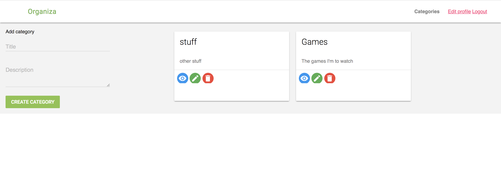

# Organizer App

## Production
This app is live here: https://organiza.herokuapp.com

It is built to help you organize your life, by creating categories where the items can be added depending on the situation.
Categories Todo can be created for items to be done. Each category can be given a Title and a Description and respective items can be added to them. 

The features included in this application allow a registered user to: 

- create, view, edit and delete items in categories.
- add, update or delete items in their respective categories.

## Development
This application was built using:
- Ruby/Ruby on Rails
- CSS/SCSS
- Material UI

## Installation
1. Ensure to have Ruby and Bundler installed on your system
2. Clone the repository using:
    
        git clone https://github.com/lornatumuhairwe/Organizer-RoR.git
        
3. Go to the app directory:
        
        $ cd Organizer-RoR
        
4. Install the dependencies using:

        bundle install --path vendor/bundle
        
5. Run application

        rails s
        
## Tests

- Run tests with

        bundle exec rspec
